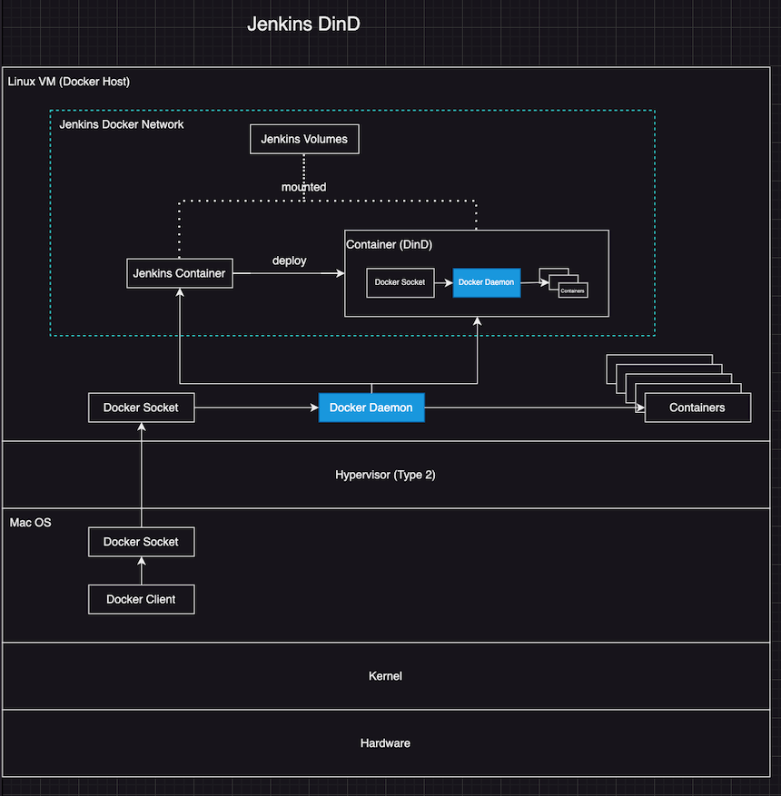
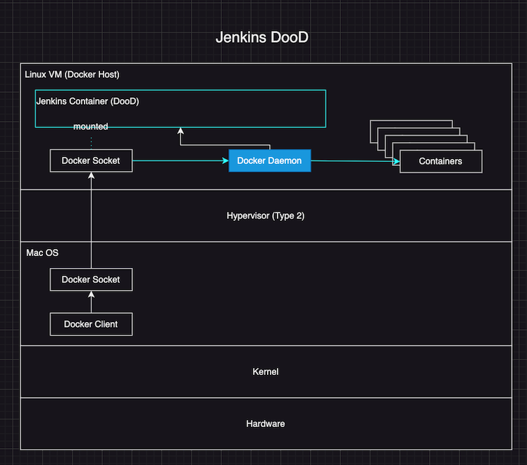
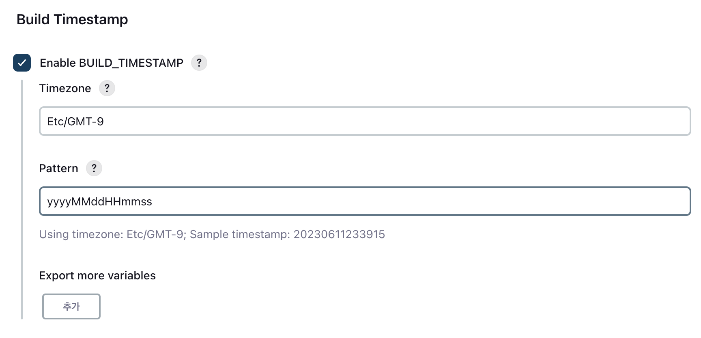
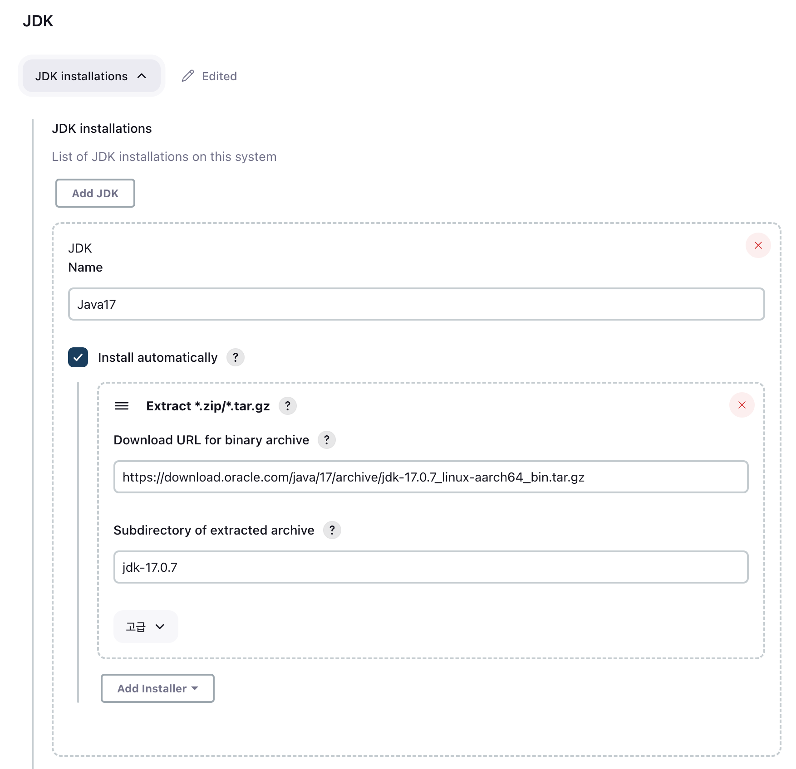
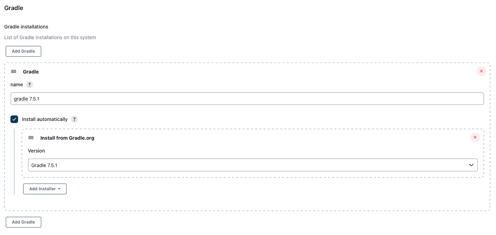
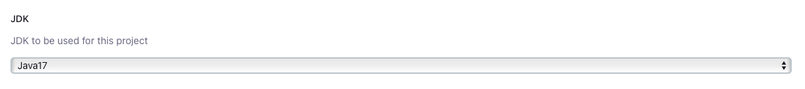
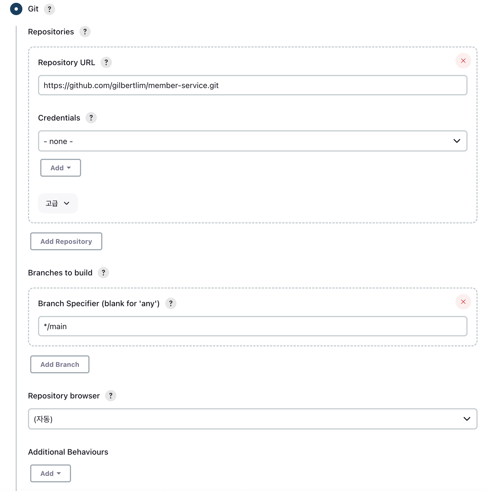
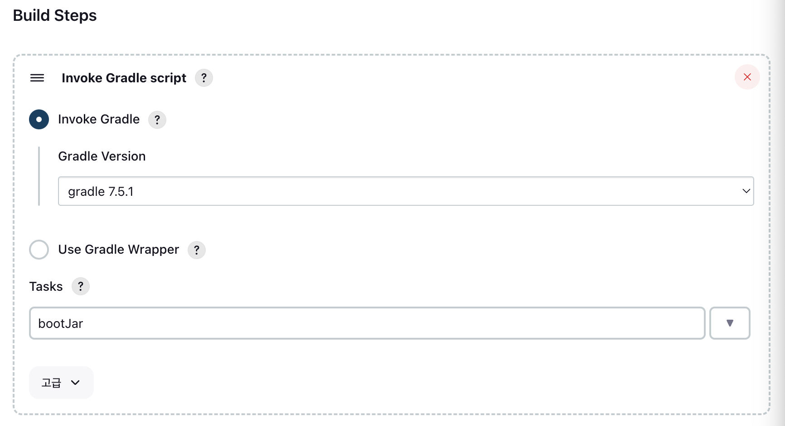
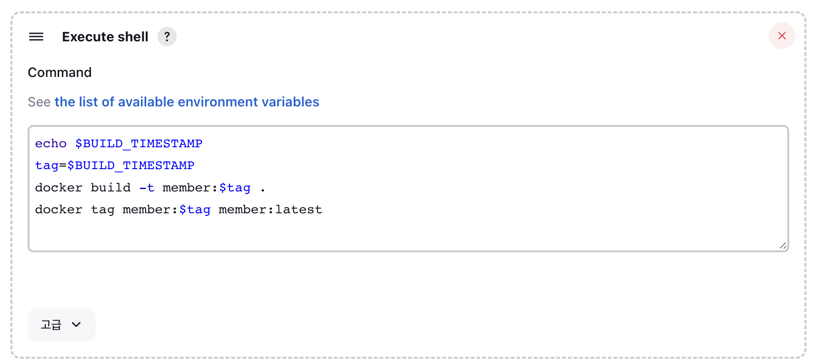
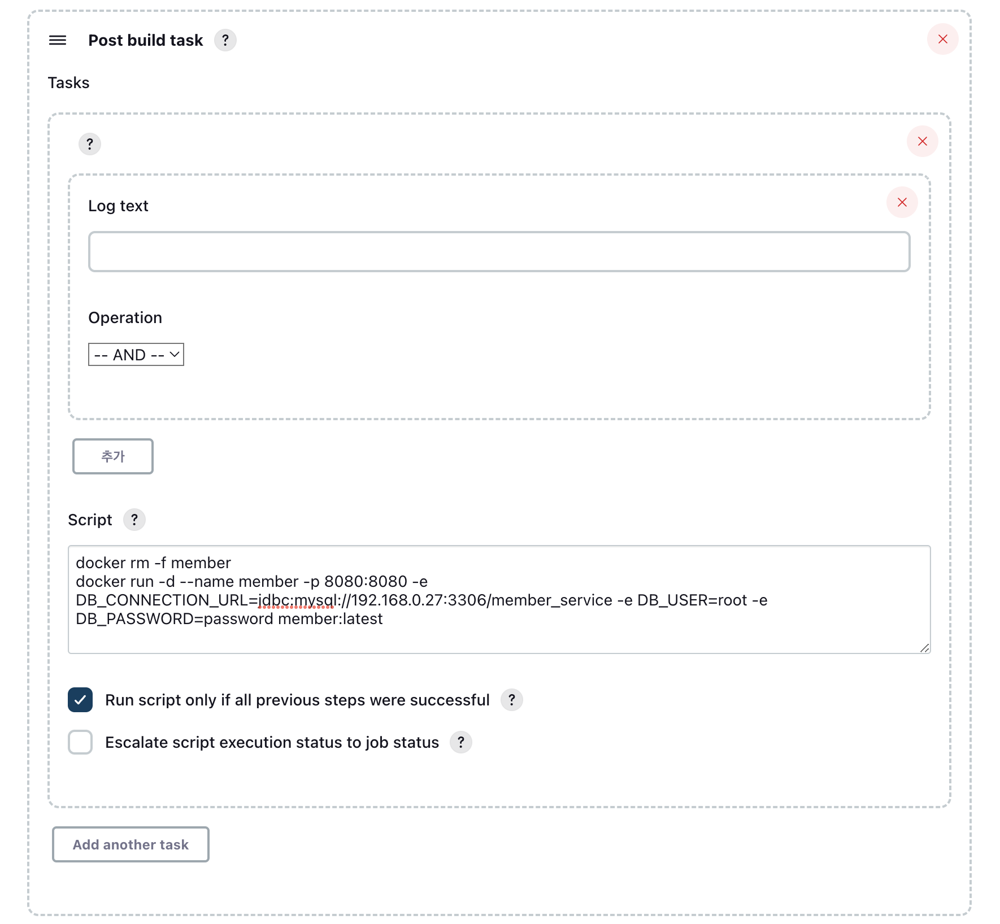

# Docker in Docker (DinD)



1. `./docker-in-docker/jenkins-dind.sh`
2. localhost:8081
3. `docker logs jenkins-master-dind` 후 초기 비밀번호 확인

<br>

# Docker outside of Docker (DooD)



1. `./docker-outside-of-docker/jenkins-dood.sh`
2. localhost:8082
3. `docker logs jenkins-master-dood` 후 초기 비밀번호 확인

<br>

# Jenkins Setting

## 1. Install Plugins (Manage Jenkins > available plugins)
- Build Timestamp
- Post build task

## 2. System Setting (Manage Jenkins > System)
- Build Timestamp
  - Timezone: `Etc/GMT-9`
  - Pattern: `yyyyMMddHHmmss`
  



## 3. Tools Setting (Manage Jenkins > Tools)
- JDK
  - Name: Java17
  - Extract \*.zip/\*.tar.gz
    - Download URL for binary archive: `https://download.oracle.com/java/17/archive/jdk-17.0.7_linux-aarch64_bin.tar.gz`
    - Subdirectory of extracted archive: `jdk-17.0.7`



- Gradle
  - name: `gradle 7.5.1`
  - Install from Gradle.org
    - Version: `Gradle 7.5.1`



## 4. Create item 'member'

Freestyle project
- JDK
  - Java17



- Source Code Management
  - Repository URL: `https://github.com/gilbertlim/member-service.git`
  - Branch Specifier: `*/main`



- Build Steps
  - Invoke Gradle script
    - Gradle Version: `gradle 7.5.1`
    - Tasks: `bootJar`



  - Execute shell
    - Command
      ```sh
      echo $BUILD_TIMESTAMP
      tag=$BUILD_TIMESTAMP
      docker build -t member:$tag .
      docker tag member:$tag member:latest
      ```



- Post-build Actions
  - Post build task
    - Script
      ```sh
      docker rm -f member
      docker run -d --name member -p 8080:8080 -e DB_CONNECTION_URL=jdbc:mysql://172.90.9.209:3306/member_service -e DB_USER=root -e DB_PASSWORD=password member:latest
      ```
    - Run script only if all previous steps were successful




## 5. Build

1. Dashboard > member > Build Now > #Build Number > Console Output
2. Check Result
- `docker exec -it jenkins-master-dind docker ps`